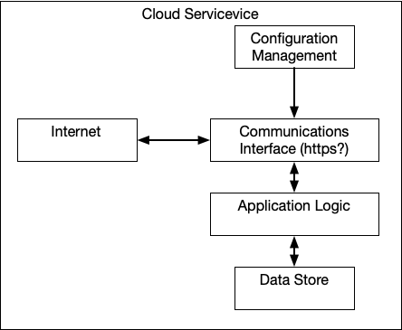
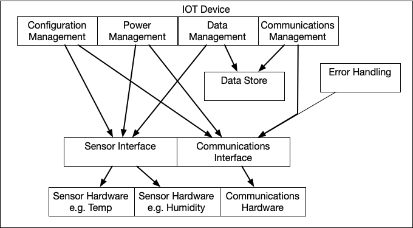

# IoT System Design Question

This is a proposed design for an IoT system whose requirements are here: [requirements](requirements.md)

# Executive Summary
This design presents a comprehensive IoT telemetry system for industrial monitoring with two main components: a cloud service and IoT edge devices. The architecture prioritizes efficient resource usage on constrained hardware while ensuring reliable data transfer and critical alert handling.

The cloud service leverages AWS infrastructure with a stateless server design backed by DynamoDB for persistence. It manages device configurations, processes incoming sensor data, and implements application logic for system control.

The IoT devices employ a modular architecture featuring circular buffer management to prevent memory overflow, prioritized data transmission for critical alerts, and graceful handling of network failures. The system includes robust power management for battery-operated scenarios, flexible sensor interfaces for future expandability, and comprehensive error detection and reporting.

Key technical considerations include secure communications, data compression to optimize bandwidth, and intelligent scheduling of transmissions to balance power conservation with timely alert delivery. The modular design ensures new sensor types can be easily integrated as requirements evolve.

# Cloud Service

There's not a lot in the requirements for the cloud service, so, here are some suggestions:

## Assume
AWS

## Server
A server that can be deployed in multiple regions, that keeps its state in a replicated database (DynamoDB). A lambda can be used if it's possible that all interactions with the server can be initiated with the IoT device.

## Requirements
The server must serve the configuration data for the IoT devices.

The server must answer requests to save sensor data.

The server may contact IoT devices with instructions to change their state.

## Components

### Configuration Management

The Configuration management component will configure the servers as well as provide configuration information to the IoT devices.

### Application Logic

The application logic will monitor the incoming data and make decisions about how to control the system.

#### State changes
* Turn things on/off
* Update configuration
* Restart/Reset components
* ...

### Communications Interface

Provide a key exchange (like https) mechanism for all communications to cloud server.
Authenticate cloud server.
Authenticate IoT device to cloud server.

Provide an interface for IoT devices to communicate with:
* ReST
* gRPC
* MQTT
* TCP/IP
* others?

Provide an interface for the Application Logic to communicate with the IoT devices.

Attempt to communicate with IoT devices that haven't been heard from in a while.

### Datastore

Assuming the cloud server is stateless, the state can be stored in a replicating database e.g. DynamoDB so that on restart, the cloud server can pick up where it left off.

# IoT DeviceCloud Service

## Configuration Management

* Contact a 'well known' configuration server over a secure link
* Obtain:
  * Cloud Server addresses
  * Cloud Server Credentials
  * Compression specs
  * Priorities
  * Data Transfer parameters (intervals, size limits ...) 
  * Circular buffer management parameters
  * Logging, error reporting parameters
  * Sensors available
  * Per Sensor configuration
    * Hardware details
    * Normal ranges
    * Alert conditions
    * Sampling intervals
    * Reporting intervals
  
  
## Power Management
Since the requirements mention 'low power', I'm assuming that the IoT devices might be battery operated. There are a number of power related considerations.

Push or pull model of communications. (describe below)

In a push model, the IoT device can shut down communications devices between update intervals.

Implementing 'low power' modes between update intervals.

In a pull model, returning to normal power mode can be triggered by network activity.

Controlling power to the sensors, and local indicators may save power.

## Data Management

The Data Management component will manage the collection of data along with freeing storage resources as the data is received by and acknowledged by the cloud server.

During normal operations, the component will handle any necessary data compression.

If the IoT device is unable to connect to the cloud server for a long time, further compression (e.g. discarding some data may be necessary)

## Communications Management
This component will monitor the data collected and the update intervals and initiate data transfers, monitor acknowledgements and implement retries.

When data is successfully transferred, this component will inform Data Management that it can reclaim the resources holding the data.o

### Push model (from IoT Device POV)

The IoT might poll the cloud server periodically for alerts, turning off networking gear between periods. This is a lower power solution.

### Pull Model
IoT device is always available over network.

## Data Store
### Implements
* Storage in non-volatile memory if required
* Erasure of memory
* Implement Circular buffer management
* Implement Alert buffer management
* Deduplication where appropriate

## Sensor Interface

The sensor interface should allow multiple sensors to be handled by the IoT device.

The sensor interface should be generic enough to allow different types of sensors to be added in the future all through a common interface.

The sensor interface should be able to detect sensor failures and report them.

## Communications Interface
This component would make decisions about when to connect to the cloud server and upload data. It would handle acknowledgements, retries etc.

It would also handle prioritizing conditions that need to be sent to the Cloud Server, along with handling incoming high priority messaging.

Examples of high priority messages would be sensor values that indicate a failed sensor, or sensor values that indicate a run-away process variable. These alerts should be scheduled immediately and ahead of returning normal sensor data.

## Sensor Hardware

This is the source of data. I'd assume there are sensing devices as well as controlling devices.

## Communications Hardware

A simple example would be WIFI/Ethernet/LTE connected to a WAN.

Other examples would be LORA which would require a gateway to reach the Internet.

## Error Handling

A watchdog timer will detect a 'stuck', 'hung' or 'deadlocked' condition and restart the IoT device while simultaneously preparing a report to be sent to the cloud device after the restart.

Software errors, and logs will be sent to the cloud server for testing, debugging, troubleshooting.
